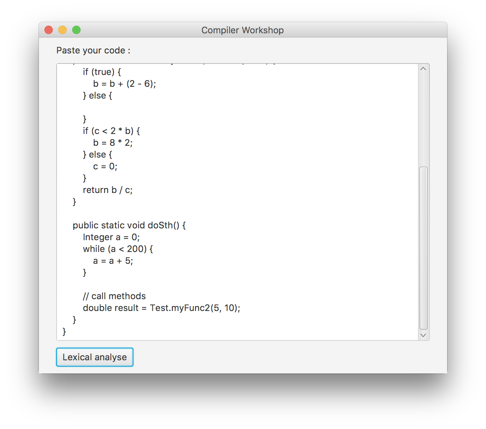
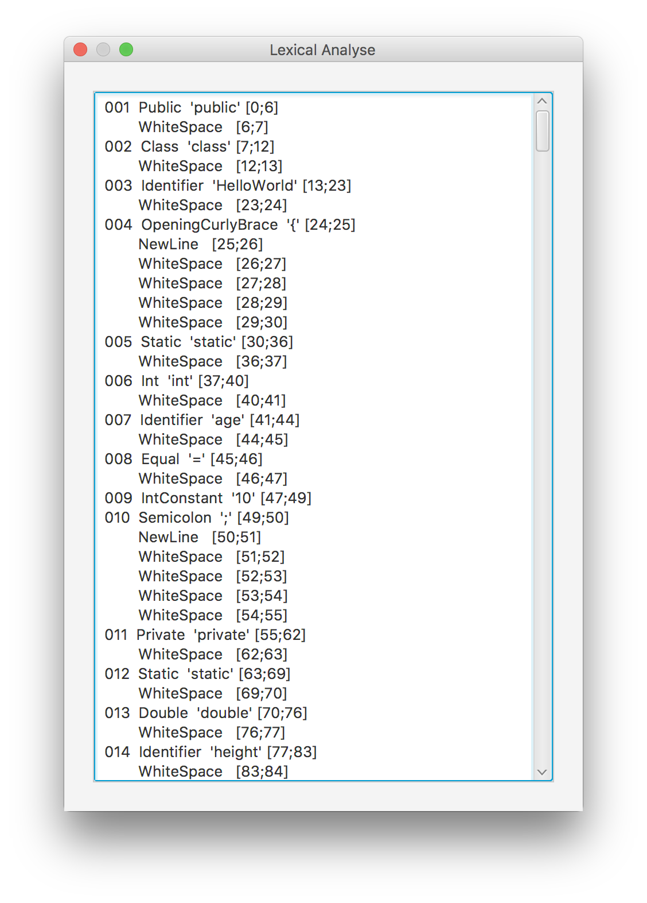
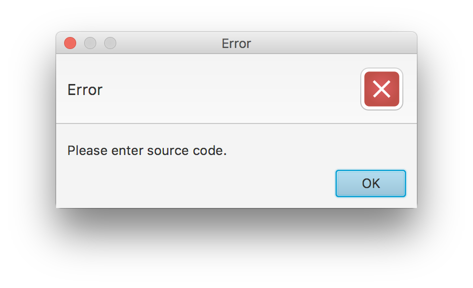

# JavaCompiler by Kotlin :)

This repository contains the source code of an **INCOMPLETE** Java Compiler just has first step of compiling steps, and proudly written in Kotlin Language.

#   Features
1.  Detects 40 **Token Type**
1.  Simple coding
1.  Written in Kotlin language
1.  Used [JavaFx][1] for creating GUI

####  Developed by [IntelliJ IDEA][2] 2018.1

#   ScreenShot

#   License
Copyright 2018 [Farhad Beigirad][3]

Licensed under the Apache License, Version 2.0 (the "License");
you may not use this file except in compliance with the License.
You may obtain a copy of the License at

    http://www.apache.org/licenses/LICENSE-2.0

Unless required by applicable law or agreed to in writing, software
distributed under the License is distributed on an "AS IS" BASIS,
WITHOUT WARRANTIES OR CONDITIONS OF ANY KIND, either express or implied.
See the License for the specific language governing permissions and
limitations under the License.

[1]: http://www.oracle.com/technetwork/java/javafx/overview/index.html
[2]: https://www.jetbrains.com/idea/
[3]: http://beigirad.ir